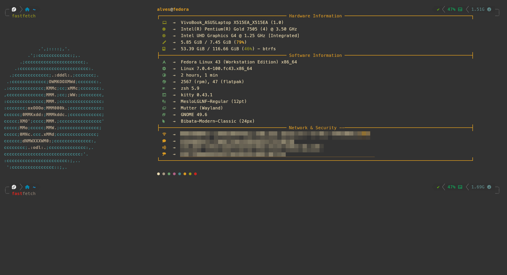
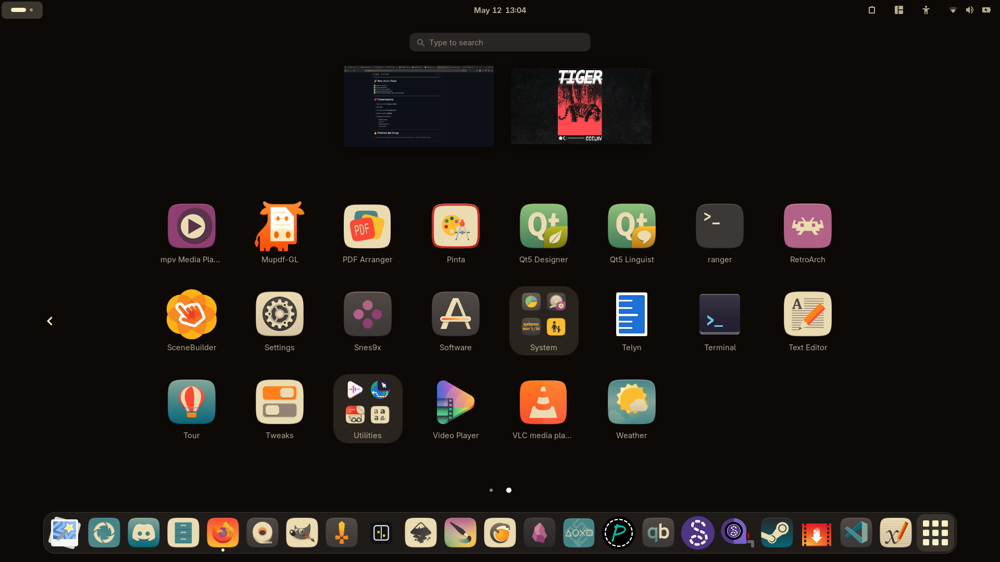

# 🐧 CONFIGS LINUX

> Minha configuração pessoal para desenvolvimento, produtividade e estética no Linux.
> Ambiente focado em **GNOME + ZSH + ferramentas modernas**.

---

# 📦 FLATPAK APPS
Aplicativos instalados via Flatpak:

```bash
flatpak install \
net.pcsx2.PCSX2 \
com.github.xournalpp.xournalpp \
com.github.unrud.VideoDownloader \
io.seamly.seamly2d \
org.qbittorrent.qBittorrent \
net.fasterland.converseen \
md.obsidian.Obsidian \
net.lutris.Lutris
```

### Apps incluídos

* 🎮 PCSX2
* 📝 Xournal++
* 📥 Video Downloader
* ✂️ Converseen
* 🧵 Seamly2D
* 📚 Obsidian
* 🌊 qBittorrent
* 🍷 Lutris

---

# ⚙️ PACOTES GLOBAIS
Pacotes essenciais para produtividade e terminal:

```bash
git zsh btop fastfetch speedtest-cli
discord lsd gimp krita
```

### Ferramentas

| Ferramenta      | Descrição               |
| --------------- | ----------------------- |
| `git`           | Controle de versão      |
| `zsh`           | Shell principal         |
| `btop`          | Monitor de sistema      |
| `fastfetch`     | Informações do sistema  |
| `speedtest-cli` | Teste de internet       |
| `lsd`           | `ls` moderno e colorido |
| `gimp`          | Edição de imagem        |
| `krita`         | Ilustração e pintura    |

---

# 💻 TERMINAL SETUP
## Oh My Zsh

Instalação do Oh My Zsh:

```bash
sh -c "$(curl -fsSL https://raw.githubusercontent.com/ohmyzsh/ohmyzsh/master/tools/install.sh)"
```

---

## Plugins do ZSH

### zsh-autosuggestions

```bash
git clone https://github.com/zsh-users/zsh-autosuggestions \
${ZSH_CUSTOM:-~/.oh-my-zsh/custom}/plugins/zsh-autosuggestions
```

### zsh-syntax-highlighting

```bash
git clone https://github.com/zsh-users/zsh-syntax-highlighting.git \
${ZSH_CUSTOM:-~/.oh-my-zsh/custom}/plugins/zsh-syntax-highlighting
```

---

## Tema Powerlevel10k

```bash
git clone --depth=1 https://github.com/romkatv/powerlevel10k.git \
"${ZSH_CUSTOM:-$HOME/.oh-my-zsh/custom}/themes/powerlevel10k"
```

Tema utilizado:

* ⚡ `powerlevel10k/powerlevel10k`

---

# 🧠 IDEs & DESENVOLVIMENTO
## Visual Studio Code

🔗 [https://code.visualstudio.com/download](https://code.visualstudio.com/download)

## Spring Tools for Eclipse

🔗 [https://cdn.spring.io/spring-tools/release/dist/5.1.0.RELEASE/e4.39/spring-tools-for-eclipse-5.1.0.RELEASE-e4.39.0-linux.gtk.x86_64.tar.gz](https://cdn.spring.io/spring-tools/release/dist/5.1.0.RELEASE/e4.39/spring-tools-for-eclipse-5.1.0.RELEASE-e4.39.0-linux.gtk.x86_64.tar.gz)

## NetBeans

🔗 [https://www.codelerity.com/netbeans/](https://www.codelerity.com/netbeans/)

---

# 🎨 ESTÉTICA / RICE
## Cursor

### Bibata Modern Classic

🔗 [https://www.pling.com/p/1914825/](https://www.pling.com/p/1914825/)

---

## Tema GTK

### Gruvbox GTK Theme

🔗 [https://www.opendesktop.org/p/1681313/](https://www.opendesktop.org/p/1681313/)

---

## Ícones

### Gruvbox Plus Icon Pack

🔗 [https://www.opendesktop.org/p/1961046/](https://www.opendesktop.org/p/1961046/)

---

## GNOME Shell

### Gruvbox GNOME Shell Theme

🔗 [https://www.opendesktop.org/p/1681451/](https://www.opendesktop.org/p/1681451/)

---

## Fonte Nerd Font

### MesloLG Nerd Font

🔗 [https://github.com/ryanoasis/nerd-fonts/releases/download/v3.4.0/Meslo.zip](https://github.com/ryanoasis/nerd-fonts/releases/download/v3.4.0/Meslo.zip)

---

# 🖥️ GNOME

## Aplicativos

```bash
flatpak install com.mattjakeman.ExtensionManager
```

```bash
sudo apt install gnome-tweaks
```

### Utilitários

* 🧩 Extension Manager
* 🎛️ GNOME Tweaks

### 🛠️ Extensões
---


---

# 🚀 RESULTADO FINAL
✅ Ambiente moderno \
✅ Terminal produtivo \
✅ Visual Gruvbox completo \
✅ Setup para desenvolvimento \
✅ Ferramentas para design, jogos e produtividade

---

# 📌 OBSERVAÇÕES
* Sistema utilizado: **Qualquer Distro**
* Shell: **ZSH**
* Tema do terminal: **Powerlevel10k**
* Ambiente gráfico: **GNOME**
* Configuração focada em:

  * produtividade
  * estética
  * desenvolvimento
  * organização

---

# 🔥 PREVIEW DO SETUP

 🔳 TERMINAL \
 ✅ Funcionando com tema e plugins  



---

#💻 APPS

